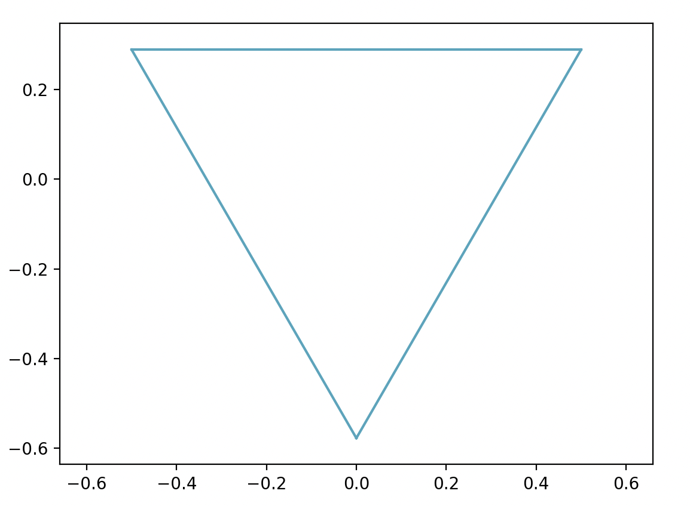
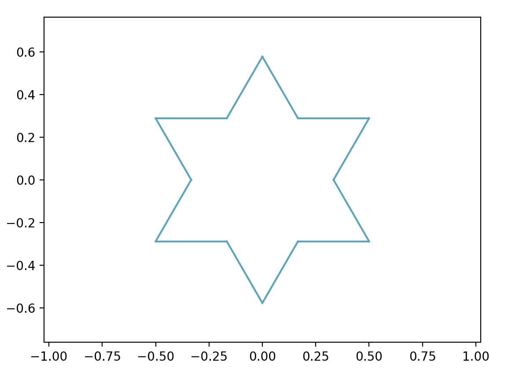
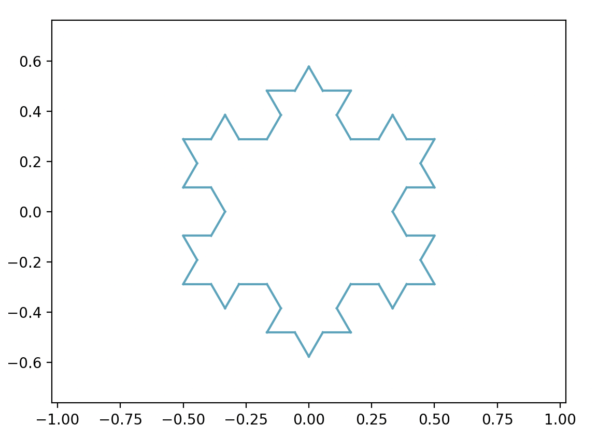
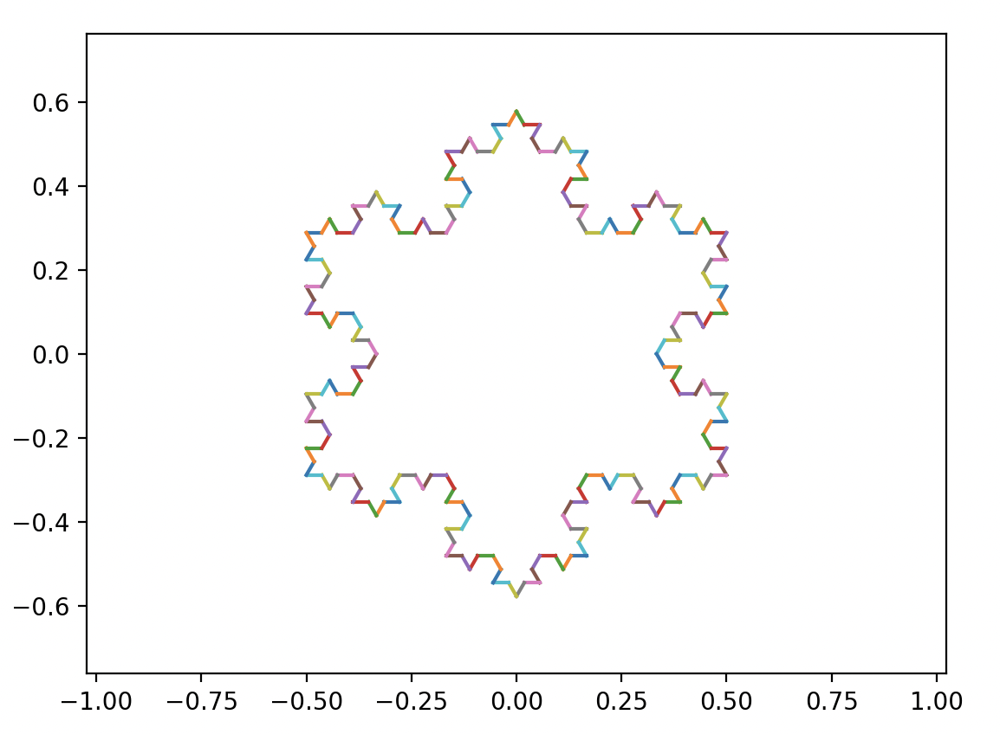
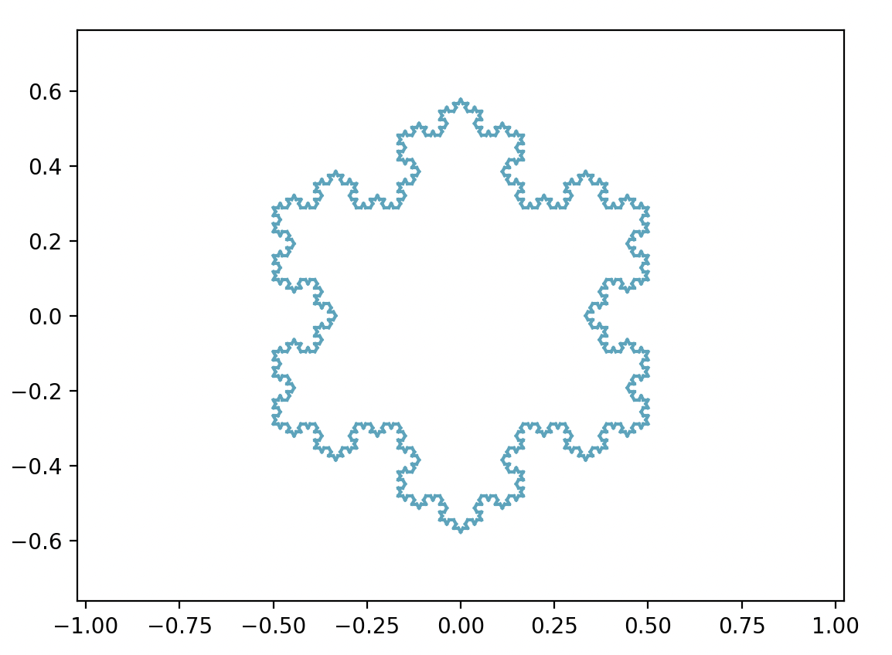

# koch-fractal
### A Simple python library for generating [Koch Snowflakes](https://en.wikipedia.org/wiki/Koch_snowflake)

## Install
#### Using pip
`pip install -r requirements.txt`

#### Using pipenv
`pipenv install

### Usage

Configure the number of iterations and the color of the plot in `config.py`.

Run `main.py`

### Examples

